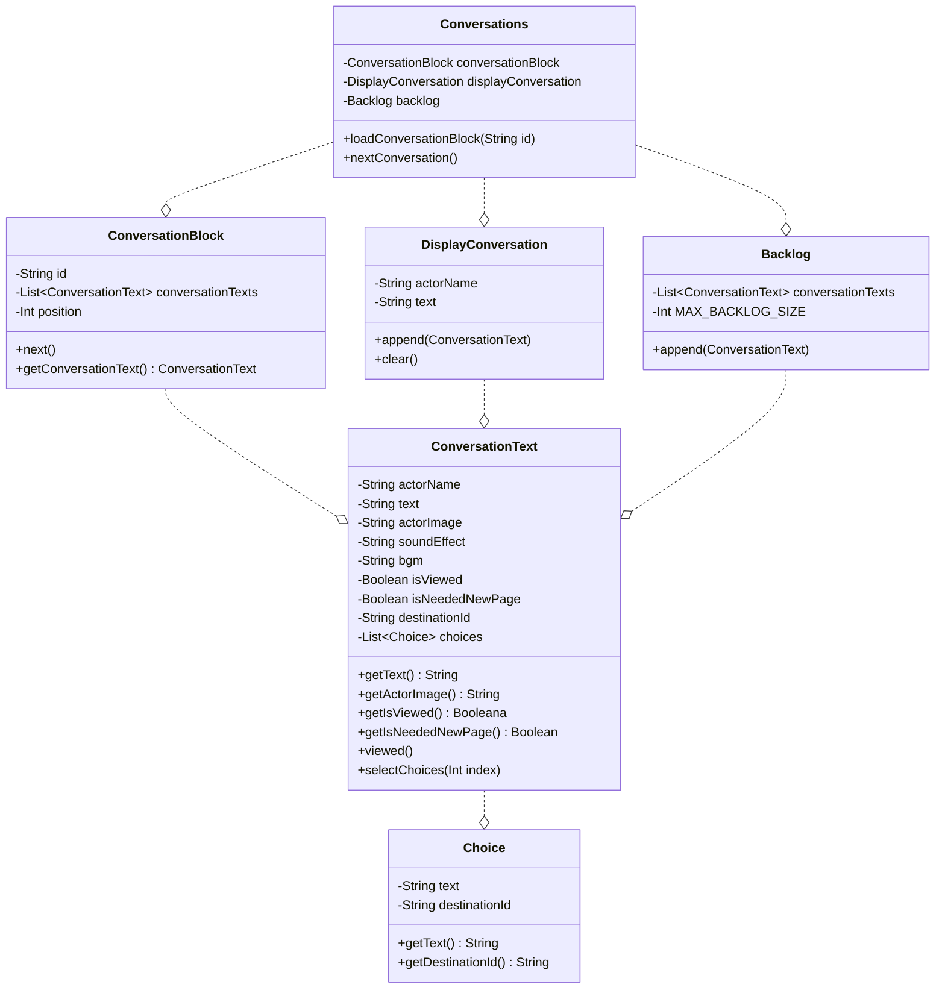

# s009_backlog

## クラス図

```mermaid
classDiagram
    class ConversationText {
        -String actorName
        -String text
        -String actorImage
        -String soundEffect
        -String bgm
        -Boolean isViewed
        -Boolean isNeededNewPage
        -String destinationId
        -List~Choice~ choices
        +getText() String
        +getActorImage() String
        +getIsViewed() Booleana
        +getIsNeededNewPage() Boolean
        +viewed()
        +selectChoices(Int index)
    }
    class ConversationBlock {
        -String id
        -List~ConversationText~ conversationTexts
        -Int position
        +next()
        +getConversationText() ConversationText
    }
    class Conversations {
        -ConversationBlock conversationBlock
        -DisplayConversation displayConversation
        -Backlog backlog
        +loadConversationBlock(String id)
        +nextConversation()
    }
    class DisplayConversation {
        -String actorName
        -String text
        +append(ConversationText)
        +clear()
    }
    class Choice {
        -String text
        -String destinationId
        +getText() String
        +getDestinationId() String
    }
    class Backlog {
        -List~ConversationText~ conversationTexts
        -Int MAX_BACKLOG_SIZE
        +append(ConversationText)
    }

    Conversations ..o ConversationBlock
    Conversations ..o DisplayConversation
    Conversations ..o Backlog
    ConversationBlock ..o ConversationText
    ConversationText ..o Choice
    DisplayConversation ..o ConversationText
    Backlog ..o ConversationText
```