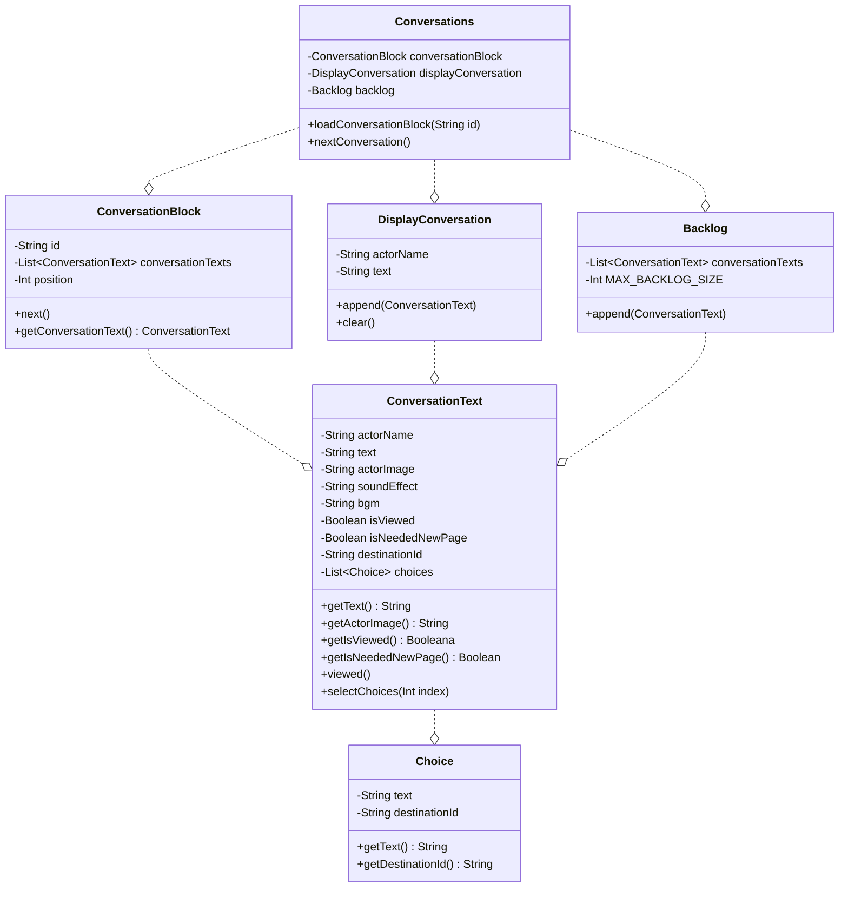

# s009_backlog

## クラス図

## クラス説明

### Conversations

すべての会話を管理するマネージャクラス。
UI からはこの Conversations オブジェクトを介して操作する。

### ConversationBlock

ConversationText をある程度まとめたブロック。
ConversationBlock は必ず ID を持っており、ID で次の ConversationBlock がきまる。
つまり、ID で連鎖するチェーン構造になっている。

### DisplayConversation

画面上に表示する会話。

### Backlog

過去に表示された会話のログ。

### ConversationText

1人の人物が一度におこなう会話を表現するオブジェクト。
`destinationId` は次の ConversationBlock を示す。

### Choice

選択肢オブジェクト。